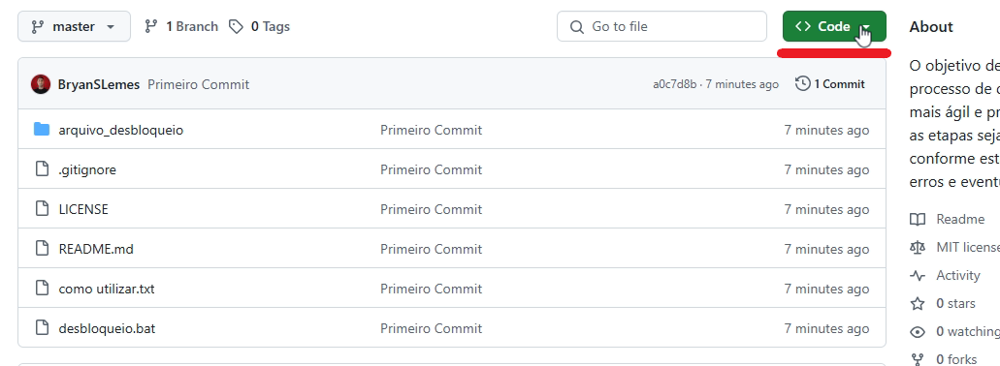
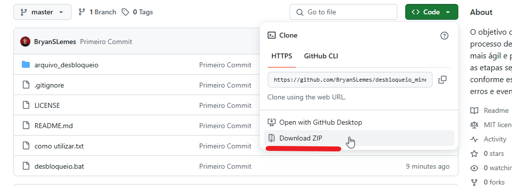
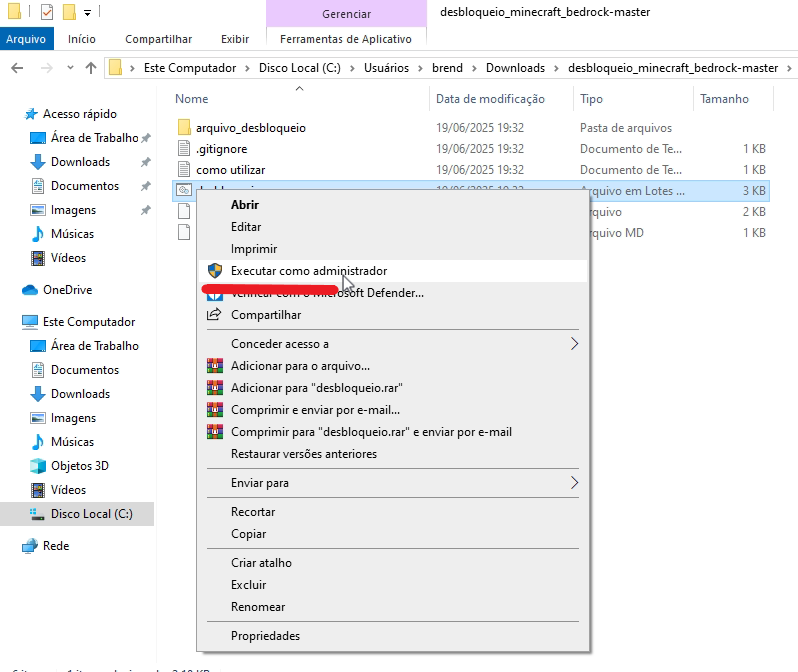
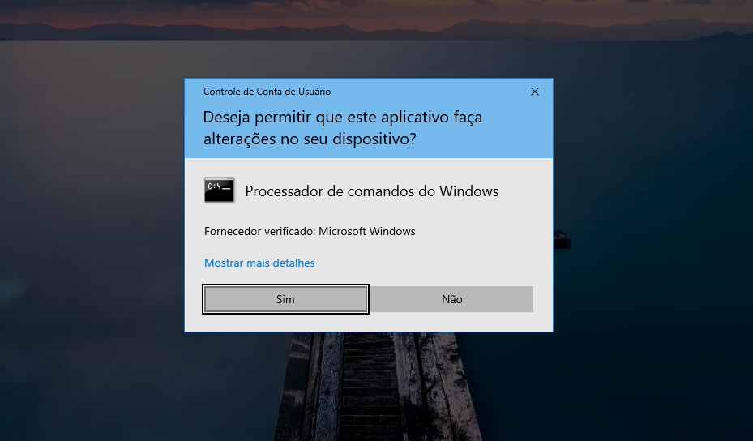
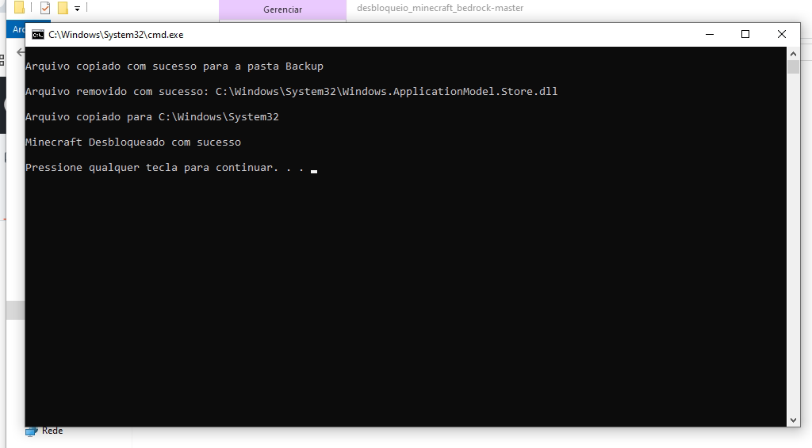

# Desbloqueio Minecraft Bedrock

## Sobre o projeto
O objetivo deste script é tornar o processo de desbloqueio do Minecraft mais ágil e prático, garantindo que todas as etapas sejam executadas exatamente conforme estabelecido, a fim de evitar erros e eventuais problemas.

## Licença

[](https://github.com/BryanSLemes/desbloqueio_minecraft_bedrock/blob/master/LICENSE)

<h1 id="executar-projeto">Como Executar o projeto</h1>

## Clone o repositório
Baixe o projeto via Git:

```bash
git clone https://github.com/BryanSLemes/desbloqueio_minecraft_bedrock
```

Ou baixe o projeto compactado como ZIP diretamente do GitHub:

Clique no botão Code

Selecione Download ZIP

 


## Execute o script

1. Extraia o conteúdo do projeto (caso tenha baixado o ZIP).

2. Clique com o botão direito sobre o arquivo `desbloqueio.bat` e selecione <b>Executar como administrador:</b>

```bash
desbloqueio.bat
```




## Resultado da Execução

Ao executar o script, o seguinte fluxo será seguido automaticamente:

✅ Minecraft Desbloqueado com sucesso – Tudo ocorreu corretamente.

❌ Minecraft NÃO Desbloqueado. – Leia as mensagens anteriores para entender o motivo da falha.



## Informações do Script
💡 Toda a lógica do programa está implementada no arquivo desbloqueio.bat

1. Backup do Arquivo Windows.ApplicationModel.Store.dll:<br>
    O programa criará uma cópia de segurança do arquivo Windows.ApplicationModel.Store.dll antes de prosseguir.

2. Remoção do Arquivo Windows.ApplicationModel.Store.dll da pasta System32:<br>
    O programa apaga o arquivo Windows.ApplicationModel.Store.dll da pasta System32.

3. Copia do Arquivo de Desbloqueio na pasta System32:<br>
    Arquivo de Desbloqueio Windows.ApplicationModel.Store.dll presente na pasta arquivo_desbloqueio é copiado para C:\Windows\System32, concluindo o processo de desbloqueio do Minecraft.